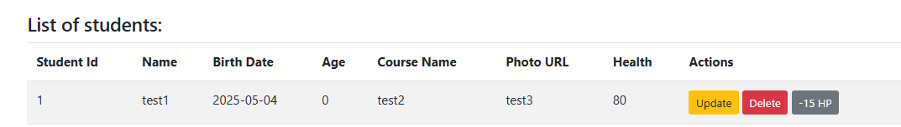
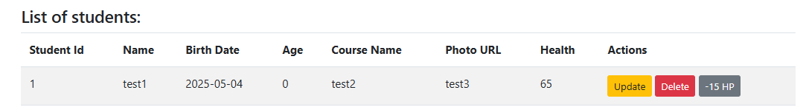
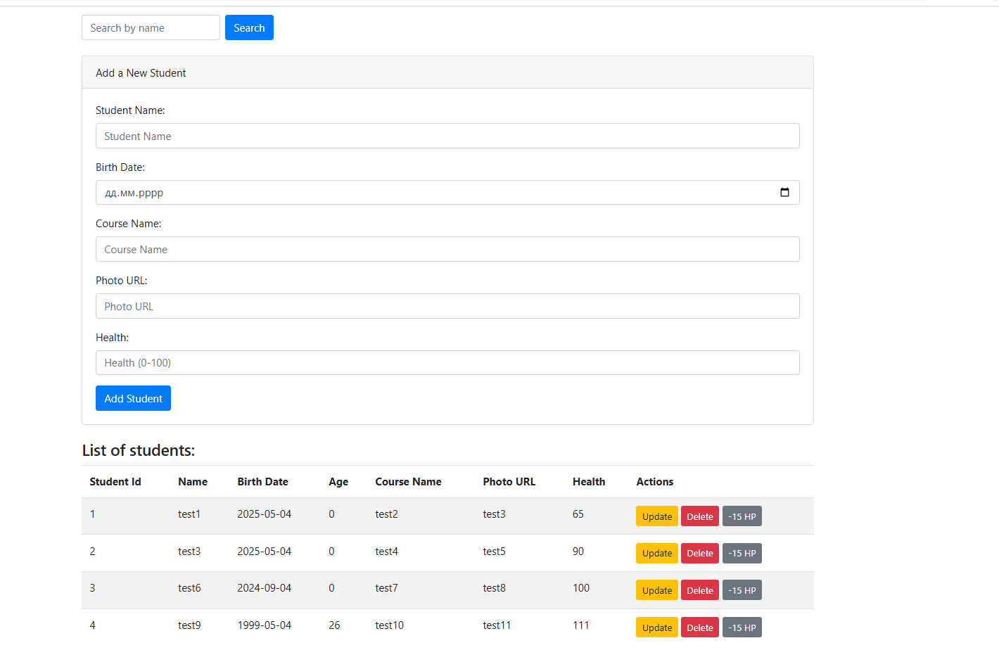
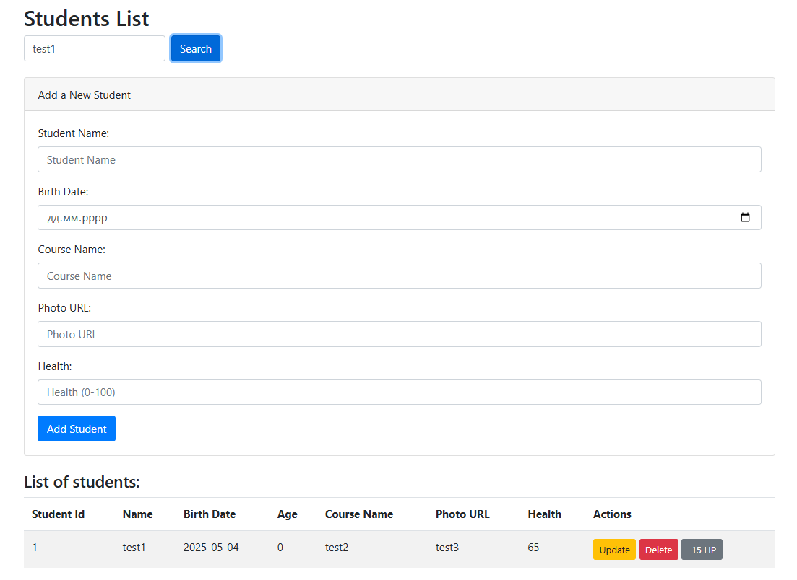

# Install poetry
pip install poetry

install flask
install flask-sqlalchemy (Database ORM)
install flask-migrate (Alembic for Database version system, migration)

1) Create Flask App
2) Config App (specify db url and others settings...)
3) Init DB and link Migration to db
Start own development
4) Define database tables with sqlalchemy models
5) Organize API routes using Flask Blueprints
6) Create API business logic (create routes functions)
7) Test your API with browser or/and Postman
8) (Optional) Create frontend part

1) Точка перевірки стану:

Реалізуйте ендпоінт /health, який повертає статус 200.
Метод віднімає від користувача 15 хп та оновлює статус

2) Детальні профілі студентів:

Додайте наступні поля:
Назва курсу
Фотографія (URL до фотографії)
Не забудьте зробити міграції.
Додайте властивість, яка буде автоматично вираховувати та повертати вік на основі дати народження.

Поле age
3) Пошук:

Додайте можливість фільтрації за  іменем. Якщо користувач вводить ім'я та натискає кнопку пошуку на фронтенді, відображаються лише відповідні результати.

Зробіть fork репозиторію (https://github.com/UmterRick/hillel_flask), створіть гілку зі своїм імʼям, запуште в свій репозиторій, створіть Pull Request в мій репозиторій.

Зробіть скріншот головної сторінки де видно що фільтр по імені працює

